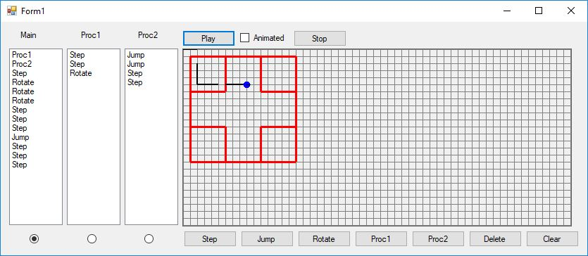

# Cangur 2.0

## Project review

The purpose of this app is to evoluate the user's algorithmic skills by comparesing the traced lines with the predefined once. Simulation process can be animated by choosing the corresponding checkbox.

## Screens

